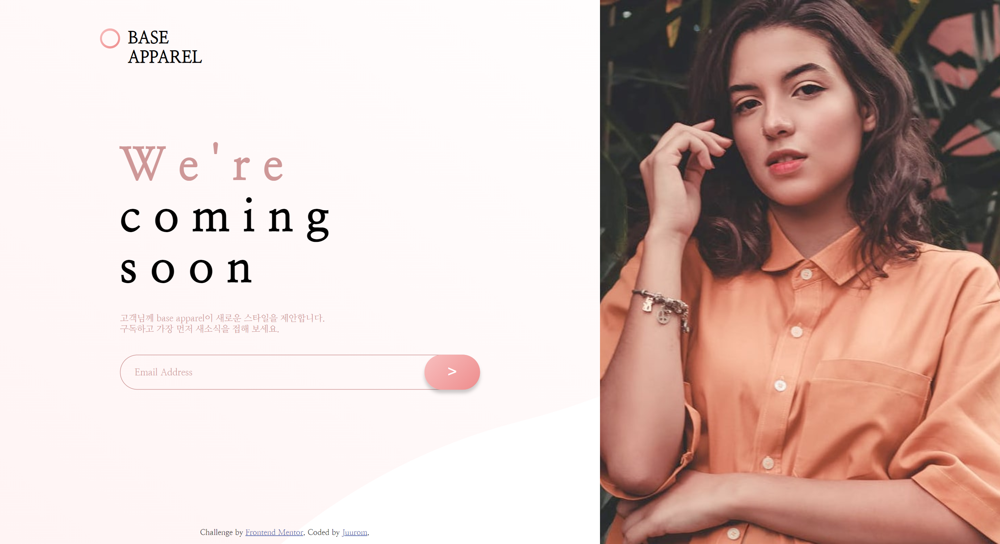
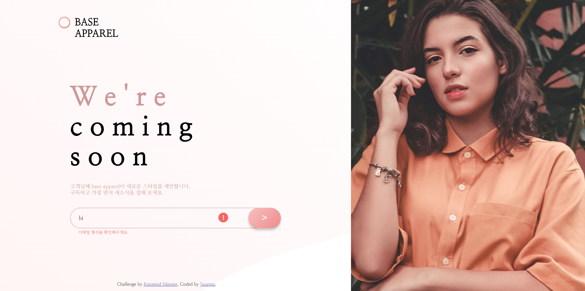
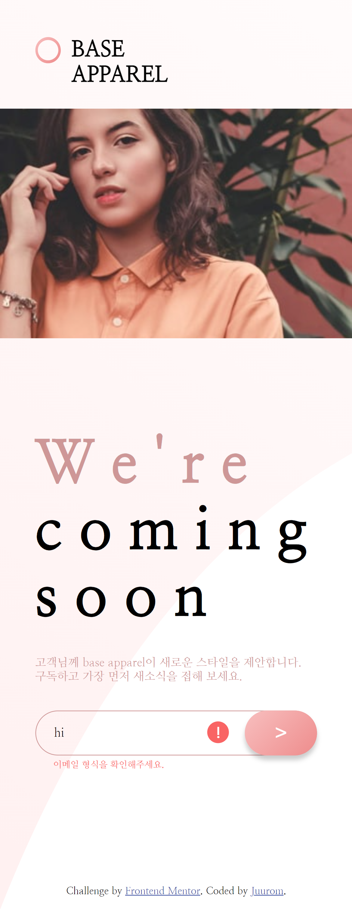

# Frontend Mentor - Base Apparel coming soon page solution

이 솔루션은 [Base Apparel coming soon page challenge on Frontend Mentor](https://www.frontendmentor.io/challenges/base-apparel-coming-soon-page-5d46b47f8db8a7063f9331a0) 챌린지 참여 결과물입니다.

## 차례

- [소개](#소개)
  - [챌린지](#챌린지)
  - [화면 스크린샷](#화면-스크린샷)
  - [링크](#링크)
- [배운 점](#배운-점)
  - [사용 tool](#사용-tool)
  - [새롭게 배운 것](#새롭게-배운-것)
  - [앞으로 배울 것](#앞으로-배울-것)
  - [참고 사이트](#참고-사이트)
- [제작자](#제작자)
- [기타사항](#기타사항)

## 소개

### 챌린지

Base apparel이라는 가상의 페이지의 새소식을 구독할 수 있도록
이메일을 입력하여 구독받는 페이지를 만들었다.
반응형 웹으로 PC, 모바일, 패드 등의 환경에서
요소의 크기를 적절하게 조정하였다.

### 화면-스크린샷






### 링크

- Solution URL: [Github](https://github.com/juurom/Base___frontendMentor/)
- Live Site URL: [Live Site](https://juurom.github.io/Base___frontendMentor/)

## 배운-점

### 사용-tool

- HTML
- CSS
- JAVASCRIPT (Jquery)

### 새롭게-배운-것

1. css grid
이... 이걸 이제야 알다니
화면 좌측, 우측 요소를 각각 40vw, 60vw로 두면
2:3 비율로 좌우로 요소가 배치되지 않고
block처럼 앞 요소는 위에, 뒷 요소는 아래에 배치되었다.
어떻게 깔끔하게 집어넣지? 하다가 css grid를 찾았다.

flex 개념 정리하면서 grid도 같이 봐야겠다.
https://studiomeal.com/archives/533

CSS
```css
#wrapper{
    display:grid;
    grid-template-columns: 3fr 2fr;
    overflow: auto;
    /*자식 div 크기에 맞게 늘어남*/
}
```

2. 반응형 웹
뷰포트 크기에 따라 화면이 보기 좋게 배치되도록 했다.
pc, tab 환경에서는 grid로 레이아웃을 배치했고,
모바일 환경에서는 block으로 레이아웃을 배치했다.

html상에서 imgdiv이 textdiv보다 앞에 오는데,
grid 레이아웃 상에서
grid-template-columns를 3fr, 2fr로 해두니까
imgdiv(좌):textdiv(우) = 3:2 로 배치되었다.
그래서 order로 순서를 바꾸어서 본래 의도한
textdiv(좌):imgdiv(우) = 3:2 로 배치해 주었다.

CSS
```css
#wrapper{
    display:grid;
    grid-template-columns: 3fr 2fr;
    overflow: auto;
}

#imgdiv{
    background-image: url(./images/hero-desktop.jpg);
    background-size: cover;
    background-repeat: no-repeat;
    height:100vh;
    overflow: hidden;
    order: 2;
}

#textdiv{
    text-align: left;
    order:1;
}

@media (max-width:820px){
    #wrapper{
      display: block;
    }
  #imgdiv{
      margin-top: 120px;
      width:100vw;
      height: 30vh;
      background-image: url(./images/hero-mobile.jpg);
      background-size: cover;
      background-repeat: no-repeat;
  }
  #textdiv{
      margin-top: 0px;
      margin-bottom: 150px;
  }
}
```

3. footer 하단 고정

구글링 해서 찾은 방법들이 모조리 안 됐는데
왜 안되는지를 고민하다가 깨달음을 얻었다!!

HTML
```html
<body>
  <div id="wrapper">
  </div>
  <footer>
  </footer>
</body>
```

CSS
```css
footer{
  position: absolute;
  bottom:0;
}
```

body 안에 wrapper div을 만들어서 contents만 집어넣는다.
그리고 footer를 따로 만들어, 부모 요소가 body이게끔 한다.
그 뒤에 position: absolute를 해 주면 된다!
(어제는 contents가 들어있는 wrapper div 안 가장 끝에
footer를 집어넣었는데 잘 안 됐었다.)

### 앞으로-배울-것

반응형 웹을 만드는 게 쉽지 않은 것 같아서
페이지 만드는 것을 한 번 더 연습했다.
css 기초 활용 방법에 대해 감이 조금 생기는 것 같다.
오늘도 화면 좌측의 textdiv 안 요소들에게 여백을 주기 위해
각각의 요소(제목, 설명, 이메일 입력칸)에 margin을 줬는데
다 하고 나니까... textdiv 자체에 padding을 주는게 훨씬 나았겠다는 생각이 들었다.

css 시작하기 전에 display를 어떻게 구성할지,
margin을 쓸지 padding을 쓸지 등은 미리 정해두어야겠다. ㅠㅠ

### 참고-사이트

- [css grid 개념](https://studiomeal.com/archives/533) - 지난번에 flex 개념 정리하려고 봤던 사이트. grid도 잘 정리되어 있다.

## 제작자

- Github - [@juurom](https://github.com/juurom/)
- Frontend Mentor - [@yourusername](https://www.frontendmentor.io/profile/juurom)

## 기타사항
오늘 페이지가 전에 ping 페이지 만들 때랑 거의 비슷한 형태여서
했던거니까 금방 끝나겠지~~ 했는데... 했는데....... ㅇ<-<
ping 만들 때는 사이즈도 다 픽셀로 때려박고 반응형 하나도 고민 안 했었는데
반응형으로 어떻게 만들지 고민하는게 꽤 많은 시간과 체력을 요구하는 것 같다...
하다 보면 익숙해질 테니 최대한 많이 해 보자.
고작 5개 했는데 확실히 개념공부 할 때보다 훨씬 공부가 되는 것 같다.
수영하는 법을 책으로 익히다가 바다에 던져진 느낌...

지금까지는 frontend mentor 사이트의 1단계 newbie 난이도를 다뤘는데,
내일부터는 2단계 junior 난이도에 도전해 봐야겠다.
잘 헤엄쳐 보자!
